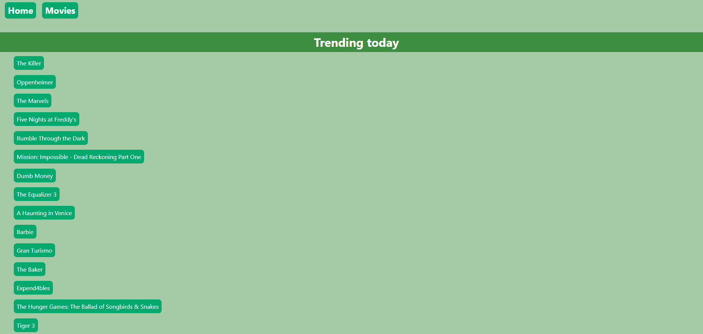
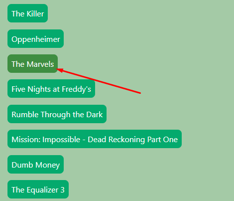
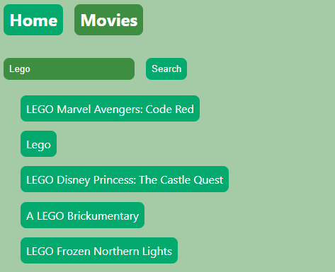
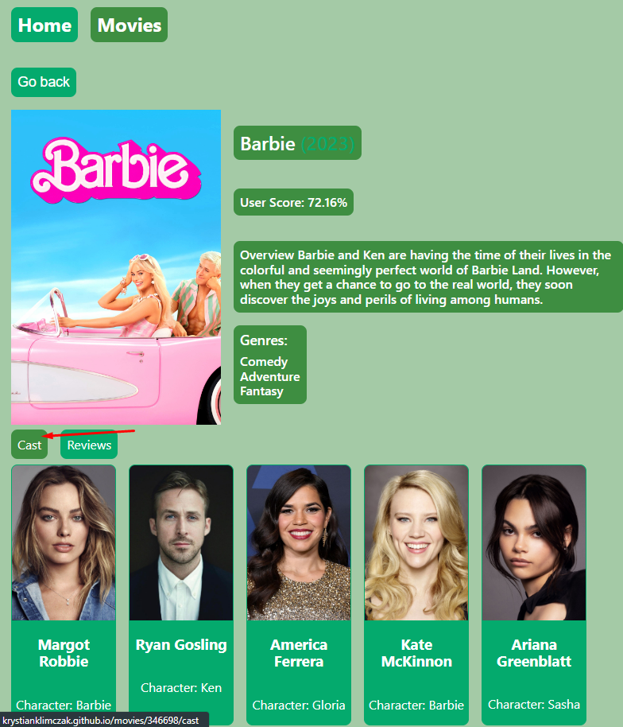
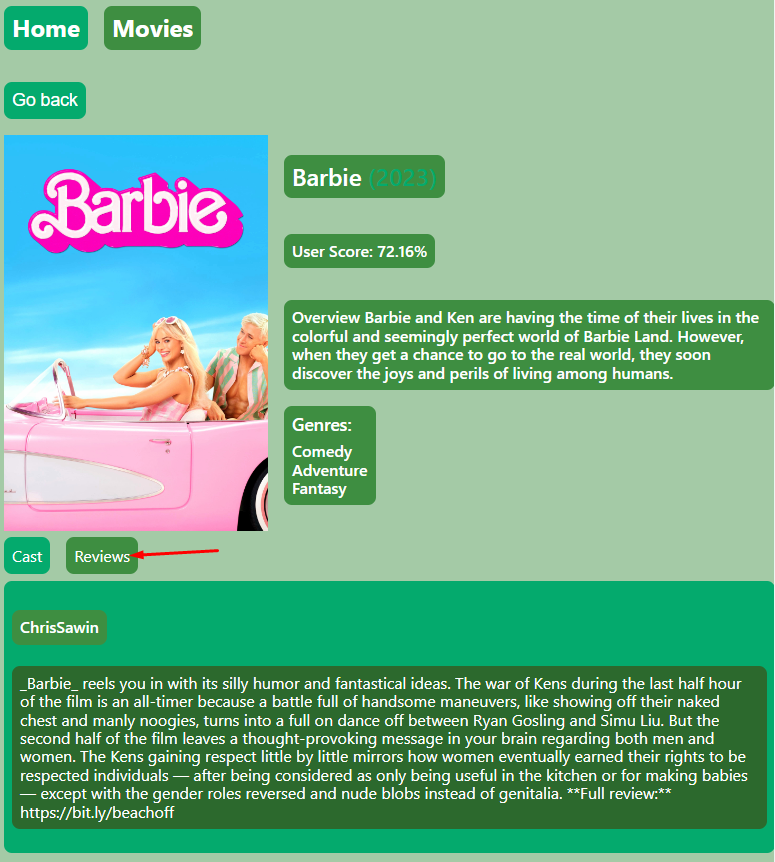

**Przeczytaj w innym języku: [polski](README.pl.md).**

# MoviesApp

Simple movies app created to allow you to search for new movies. Choose from 20
most trending movies or simply paste movie title that you are looking for. App
will search database and show you results. Created with React.js, HTML, CSS, JS,
and a bit of passion...

---

## Demo

Here is working live demo: (
https://krystianklimczak.github.io/goit-react-hw-05-movies/ )

---

## Site

### Leading page

### Simply just click movie from the list to see more details

 

### You can search movie that you are looking for, just simple fill input field on movies page and see results

### You can check the cast there

### You can check the reviews there

---

## Technologies

- HTML
- CSS
- JavaScript
- React.js

---

## Setup

Clone this repo to your desktop and run `npm install` to install all the
dependencies.

---

## Usage

After you clone this repo to your desktop, go to its root directory and run
`npm install` to install its dependencies.

Once the dependencies are installed, you can run `npm start` to start the
application. You will then be able to acces it at localhost:3000

---

## Feel free to share your opinion

- https://www.linkedin.com/in/klima96/
