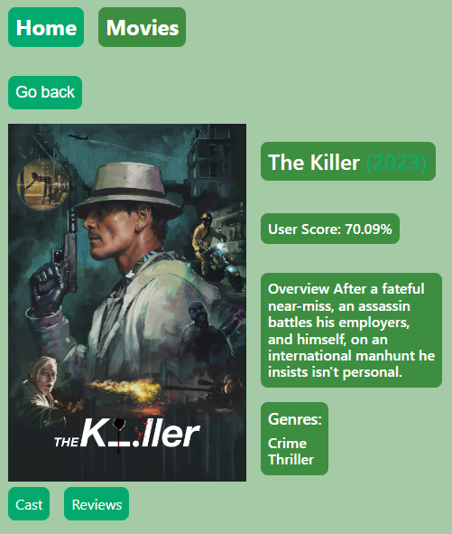
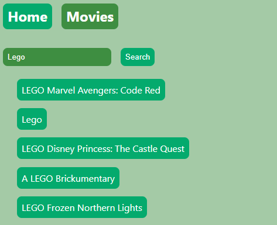
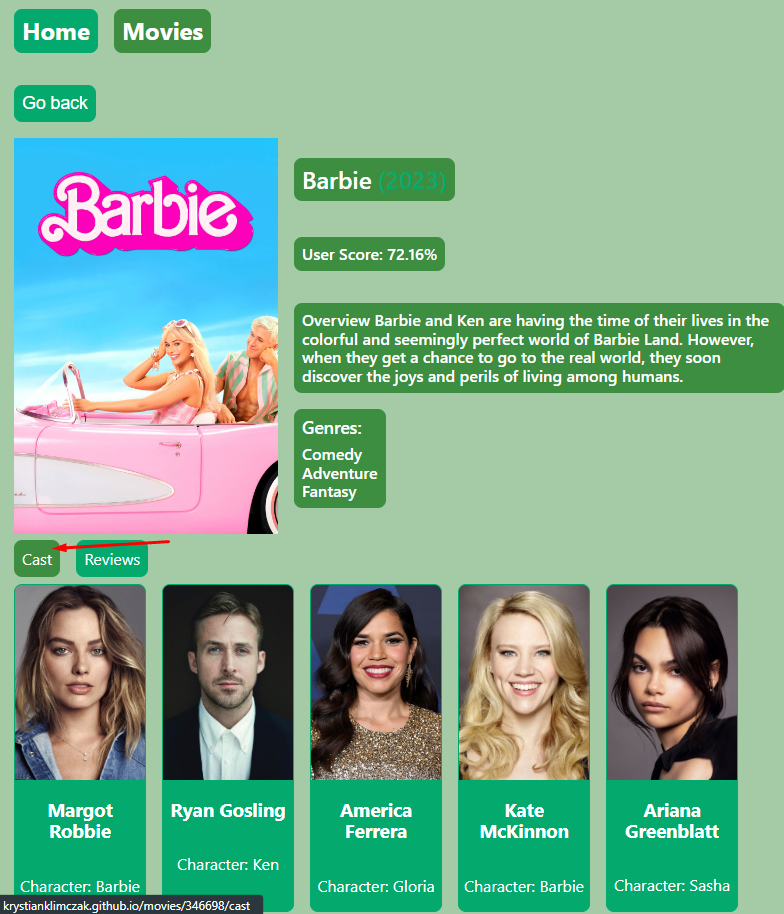
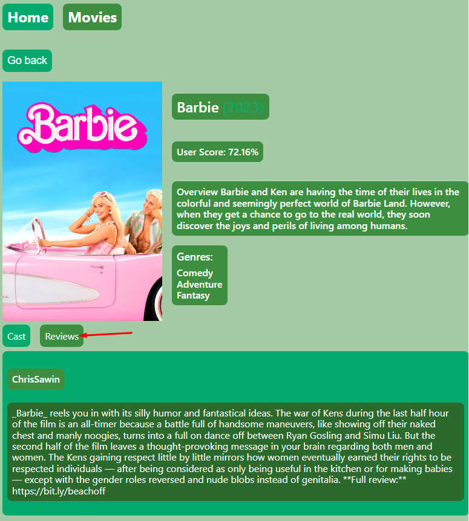

**Read in other languages: [english](README.md).**

# MoviesApp

Prosta aplikacja stworzona do wyszukiwania filmów. Wybierz spośród 20
najpopularniejszych lub po prostu wpisz tytuł filmu którego szukasz. Aplikacja
przeszuka bazę danych i wyświetli Ci wyniki. Utworzone z React.js, HTML, CSS,
JS, i odrobiną pasji...

---

## Demo

Sprawdź jak działa: (
https://krystianklimczak.github.io/goit-react-hw-05-movies/ )

---

## Site

### Strona główna

### Po prostu kliknij w film aby wyświetlić szczegóły danego filmu

 

### Możesz równiez wyszukać filmu na podstawie tytułu, po prostu wypełnij pole i kliknij enter...

### Możesz również sprawdzić obsade aktorksą filmu

### Lub przeczytać opinie danego filmu

---

## Użyte tecnnologie

- HTML
- CSS
- JavaScript
- React.js

---

## Instalacja

Zklonuj to repozytorium na swój komputer i użyj komendy `npm install` aby
zainstalować wszystkie zależności projektu.

---

## Użycie

Po zklonowaniu repozytorium na swój komputer, przejdz do głównego folderu
projektu i użyj komendy `npm install` aby zainstalować zależności.

Kiedy zależności są zainstalowane, możesz użyć komendy `npm start` aby uruchomić
aplikację. Będziesz miał wtedy dostęp do aplikacji pod adresem localhost:3000

---

## Daj mi znać co powinienem zmienić, lub co Ci się spodobało

- https://www.linkedin.com/in/klima96/
